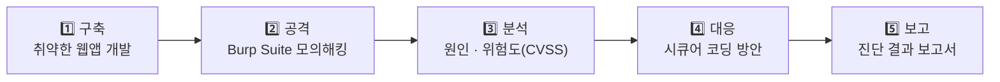

# 🔓 Vulnerable Web App — 웹 취약점 진단 & 시큐어 코딩

> OWASP Top 10 취약점을 **직접 구현 → 모의해킹 → 대응 방안 도출**까지 수행한 개인 보안 프로젝트

<p>
  
  
  
  
  
  
</p>

📄 **[진단 결과 보고서 (PDF)](./report/Vulnerable_App_Pentest_Report_2025.pdf)**

> [!WARNING]
> 이 애플리케이션은 학습을 위해 **의도적으로 취약하게** 만들었습니다. 실제 서비스나 외부에 노출된 환경에 배포하지 마세요.
> This project is intentionally vulnerable. Do **NOT** deploy it to production.

---

## 📋 목차
1. [프로젝트 개요](#-프로젝트-개요)
2. [진단 요약](#-진단-요약)
3. [취약점 상세 (원인 → 공격 → 대응)](#-취약점-상세)
4. [추가 식별 항목](#-추가-식별-항목)
5. [프로젝트 구조](#-프로젝트-구조)
6. [실행 방법](#-실행-방법)
7. [배운 점](#-배운-점)

---

## 🎯 프로젝트 개요

| 항목 | 내용 |
| :--- | :--- |
| **목적** | 이론으로 배운 웹 취약점을 공격자·방어자 양쪽 관점에서 직접 검증 |
| **기간** | 2025.11 (진단: 2025.11.24 ~ 11.27) |
| **형태** | 개인 프로젝트 (기여도 100%) |
| **진단 도구** | Burp Suite (Proxy · Repeater) |
| **배포 환경** | AWS EC2 · Security Group 화이트리스트로 관리 포트 접근 제한 |



---

## 📊 진단 요약

| # | 취약점 | OWASP Top 10 (2021) | 위치 | 위험도 | CVSS |
| :-: | :--- | :--- | :--- | :-: | :-: |
| 1 | **SQL Injection** (인증 우회) | A03 Injection | `POST /auth/login` | 🔥 Critical | 9.8 |
| 2 | **Unrestricted File Upload** | A04 Insecure Design | `POST /upload` | 🔥 Critical | 9.8 |
| 3 | **Stored XSS** | A03 Injection | `POST /post/write` | 🔴 High | 6.1 |
| 4 | **IDOR** (접근 제어 미흡) | A01 Broken Access Control | `POST /post/edit/:id` | 🔴 High | 6.5 |

---

## 🔍 취약점 상세

### 1. SQL Injection — 로그인 인증 우회

**원인** — 사용자 입력을 그대로 SQL 문자열에 이어 붙임 ([`routes/auth.js:41`](./routes/auth.js#L41))

```js
// ❌ Vulnerable
const sql = `SELECT * FROM users WHERE username = '${username}' AND password = '${password}'`;
```

**공격 (PoC)**

| 입력 | 값 |
| :--- | :--- |
| username | `' OR '1'='1' #` |
| password | (아무 값) |

```sql
-- 실제 실행된 쿼리: # 이후가 주석 처리되어 비밀번호 검증이 사라짐
SELECT * FROM users WHERE username = '' OR '1'='1' #' AND password = '...'
```
➡️ 비밀번호 없이 첫 번째 계정(관리자)으로 로그인 성공

**대응** — Prepared Statement(파라미터 바인딩)로 쿼리와 데이터를 분리

```js
// ✅ Secure
const sql = 'SELECT * FROM users WHERE username = ? AND password = ?';
db.query(sql, [username, password], callback);
```

> 같은 패턴이 회원가입(`auth.js:17`), 글 작성(`post.js:34`), 글 수정(`post.js:51`, `post.js:67`)에도 있어 모두 동일하게 조치해야 합니다.

---

### 2. Unrestricted File Upload — 악성 파일 업로드

**원인** — 확장자·MIME 검증 없이 사용자가 보낸 파일명 그대로 저장하고, 업로드 폴더를 정적 경로로 공개 ([`routes/upload.js:15`](./routes/upload.js#L15))

```js
// ❌ Vulnerable
filename: (req, file, cb) => cb(null, file.originalname)
```

**공격 (PoC)**
1. `<script>` 가 포함된 `hack.html` 업로드
2. `/uploads/hack.html` 접속 → 서비스와 **같은 출처(Origin)** 에서 악성 스크립트 실행

**대응** — 확장자 화이트리스트 + 파일명 난수화(UUID)

```js
// ✅ Secure
const { randomUUID } = require('crypto');
const ALLOWED = ['.jpg', '.jpeg', '.png'];

const storage = multer.diskStorage({
  destination: (req, file, cb) => cb(null, 'uploads/'),
  filename: (req, file, cb) => {
    const ext = path.extname(file.originalname).toLowerCase();
    cb(null, `${randomUUID()}${ext}`);
  },
});

const upload = multer({
  storage,
  limits: { fileSize: 5 * 1024 * 1024 },
  fileFilter: (req, file, cb) => {
    const ok = ALLOWED.includes(path.extname(file.originalname).toLowerCase())
            && file.mimetype.startsWith('image/');
    cb(ok ? null : new Error('허용되지 않은 파일 형식'), ok);
  },
});
```

---

### 3. Stored XSS — 게시글 악성 스크립트 저장

**원인** — 게시글 내용을 이스케이프 없이 출력하는 EJS 태그 `<%- %>` 사용 ([`views/post_list.ejs:22`](./views/post_list.ejs#L22))

```ejs
<!-- ❌ Vulnerable -->
<p>내용: <%- post.content %></p>
```

**공격 (PoC)**

```html
<script>alert(document.cookie)</script>
```
➡️ 게시글 목록을 여는 모든 사용자의 브라우저에서 스크립트 실행 (세션 쿠키 노출)

**대응** — 출력 시 HTML Entity Encoding이 적용되는 `<%= %>` 사용 + 세션 쿠키 `HttpOnly`

```ejs
<!-- ✅ Secure -->
<p>내용: <%= post.content %></p>
```

---

### 4. IDOR — 타인 게시글 무단 수정

**원인** — 글 번호(`id`)만 확인하고 요청자가 작성자인지 검증하지 않음 ([`routes/post.js:67`](./routes/post.js#L67))

```js
// ❌ Vulnerable
const sql = `UPDATE posts SET title = '${title}', content = '${content}' WHERE id = ${id}`;
```

**공격 (PoC)**
1. 본인 글 수정 요청을 Burp Suite로 가로챔
2. URL의 글 번호 변조: `/post/edit/2` → `/post/edit/1`
3. 타인의 게시글 내용이 덮어써짐

**대응** — 세션 사용자 ID와 게시글 작성자 ID를 서버에서 함께 검증

```js
// ✅ Secure
const sql = 'UPDATE posts SET title = ?, content = ? WHERE id = ? AND user_id = ?';
db.query(sql, [title, content, id, req.session.user.id], (err, result) => {
  if (result.affectedRows === 0) return res.status(403).send('권한이 없습니다.');
  res.redirect('/post');
});
```

> 수정 페이지 조회(`GET /post/edit/:id`)에도 같은 소유권 검증이 필요합니다.

---

## 🧩 추가 식별 항목

보고서의 4대 취약점 외에 코드 리뷰로 확인한 개선 포인트입니다.

| 항목 | 위치 | 문제 | 개선 방안 |
| :--- | :--- | :--- | :--- |
| 평문 비밀번호 저장 | `auth.js:17` | DB 유출 시 비밀번호 그대로 노출 | `bcrypt` 해시 저장 |
| 하드코딩된 세션 키 | `app.js` | 소스 공개 시 세션 위조 가능 | `.env`의 `SESSION_SECRET` 사용 |
| 쿠키 보안 속성 미설정 | `app.js` | XSS로 세션 탈취 가능 | `httpOnly`, `secure`, `sameSite` 설정 |
| CSRF 토큰 없음 | 모든 POST 폼 | 사용자 몰래 글 작성·수정 요청 가능 | CSRF 토큰 또는 `sameSite=strict` |
| 업로드 결과 페이지 반사형 XSS | `upload.js:34` | 파일명이 HTML에 그대로 출력 | 파일명 이스케이프 |

---

## 📁 프로젝트 구조

```
sc_pro/
├── app.js               # Express 서버 · 세션 · 라우터 설정
├── db.js                # MySQL 연결 (.env 사용)
├── routes/
│   ├── auth.js          # 회원가입 · 로그인        → SQL Injection
│   ├── post.js          # 게시글 작성 · 수정       → Stored XSS, IDOR
│   └── upload.js        # 파일 업로드              → Unrestricted File Upload
├── views/               # EJS 템플릿
├── public/              # CSS
├── uploads/             # 업로드 파일 저장 (Git 제외)
└── report/
    └── Vulnerable_App_Pentest_Report_2025.pdf
```

---

## ⚙️ 실행 방법

> 반드시 **로컬 또는 격리된 실습 환경**에서만 실행하세요.

**1. 설치**
```bash
git clone https://github.com/dlwl224/sc_pro.git
cd sc_pro
npm install
```

**2. 환경 변수** — 프로젝트 루트에 `.env` 생성
```env
DB_HOST=localhost
DB_USER=root
DB_PASS=your_password
DB_NAME=security_app
```

**3. 데이터베이스**
```sql
CREATE DATABASE security_app;
USE security_app;

CREATE TABLE users (
    id INT AUTO_INCREMENT PRIMARY KEY,
    username VARCHAR(50) NOT NULL,
    password VARCHAR(100) NOT NULL,
    created_at TIMESTAMP DEFAULT CURRENT_TIMESTAMP
);

CREATE TABLE posts (
    id INT AUTO_INCREMENT PRIMARY KEY,
    title VARCHAR(100) NOT NULL,
    content TEXT NOT NULL,
    user_id INT,
    created_at TIMESTAMP DEFAULT CURRENT_TIMESTAMP
);
```

**4. 실행**
```bash
npm start
```
➡️ 실행한 컴퓨터의 브라우저에서 `localhost:3000` 로 접속합니다. (배포된 공개 주소가 아니라, 직접 실행했을 때만 열리는 로컬 주소입니다)

---

## 💡 배운 점

- **공격자 관점** — 취약점은 "입력값을 믿는 순간" 생깁니다. 쿼리, HTML 출력, 파일명, URL 파라미터 모두 공격자가 조작할 수 있는 입력이었습니다.
- **방어자 관점** — 4개 취약점 모두 Prepared Statement, 출력 인코딩, 화이트리스트, 서버 측 권한 검증이라는 **기본 시큐어 코딩 원칙**으로 근본 조치가 가능했습니다.
- **보고 관점** — 취약점을 찾는 것만큼 위험도(CVSS)와 재현 절차, 대응 방안을 **읽는 사람이 바로 조치할 수 있게** 정리하는 것이 중요하다는 것을 배웠습니다.
